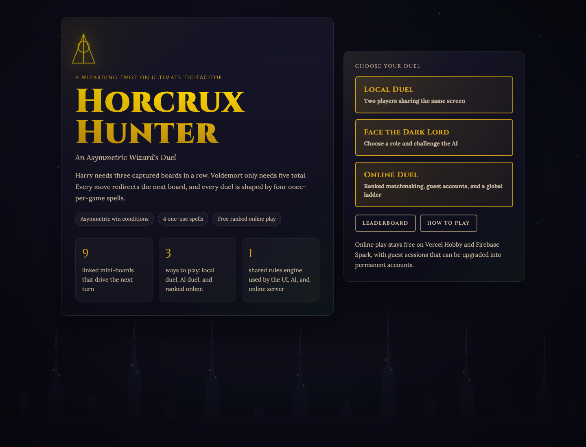

# Horcrux Hunter

[Play live on Vercel](https://ticatytacatytoe.vercel.app/)



Horcrux Hunter is a Harry Potter-flavored twist on Ultimate Tic-Tac-Toe. Harry wins by claiming 3 mini-boards in a row on the meta-grid. Voldemort wins by corrupting 5 of the 9 boards total. Both sides also get two once-per-game spells, so every match becomes a timing battle as much as a board-control puzzle.

## What Makes The Game Different

- It is asymmetric by design. Harry and Voldemort are not chasing the same win condition, so the board asks each side to value space differently.
- It keeps the core Ultimate Tic-Tac-Toe rule intact. Every move sends the opponent to their next mini-board, which turns the full 9-board grid into one connected tactical system.
- Spells bend the rules without replacing them. Expelliarmus, Patronus Shield, Avada Kedavra, and Dark Mark all create swing turns, but each one is limited to a single use.
- It supports three ways to play: couch multiplayer, AI duels, and free online ranked matchmaking.

## Play Modes

- `Local Duel`: two players, one screen.
- `Face the Dark Lord`: play either role against the AI.
- `Online Duel`: ranked matchmaking with guest accounts, reconnects, account upgrades, and a global leaderboard.
- `Online Duel`: ranked matchmaking with guest accounts, reconnects, account upgrades, live duel chat, quick reactions, and a global leaderboard.

## Technical Highlights

- The game rules live in a shared deterministic engine used by the browser UI, the AI layer, and the Vercel API routes.
- The hard AI uses minimax with alpha-beta pruning and iterative deepening rather than a simple random or scripted opponent.
- Online matches are server-authoritative. Clients submit actions, Vercel validates them by replaying the match state, and only then are results committed.
- Firebase Authentication starts players as guests and lets them upgrade into permanent accounts without losing rating or history.
- Firebase Realtime Database handles presence, ranked queue state, live match snapshots, reconnect flow, player profiles, and the public leaderboard.
- The ranked ladder uses an Elo-style system called `Dueling Rating`, starting at `1000` and updated only by the server after a verified result.
- The frontend is plain HTML, CSS, and vanilla JavaScript rather than a heavy framework, which keeps the whole project lightweight and easy to inspect.

## Stack

- `HTML + CSS + vanilla JavaScript`
- `Vite` for the browser build
- `Vercel` for hosting and API routes
- `Firebase Auth` for guest and permanent accounts
- `Firebase Realtime Database` for presence, matchmaking, matches, and leaderboard state

## Fork It Or Tinker With It

If you want to clone the repo and play with the game locally:

```bash
git clone https://github.com/manrajmondair/Ticaty-Tacaty-Toe.git
cd Ticaty-Tacaty-Toe
npm install
npm run dev
```

That is enough for the local duel and AI modes.

If you want to experiment with the online mode too:

```bash
cp .env.example .env
vercel dev
```

Then fill in the Firebase values from [.env.example](./.env.example) and publish the rules from [firebase.database.rules.json](./firebase.database.rules.json).

## License

MIT
